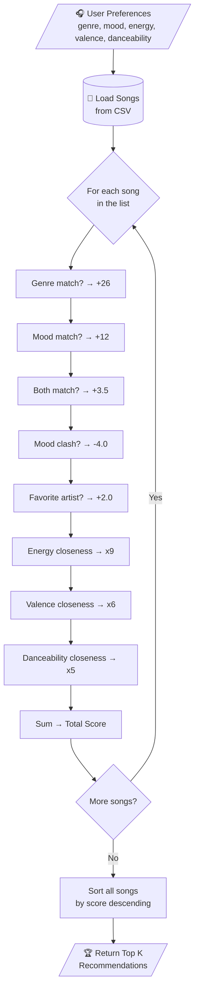
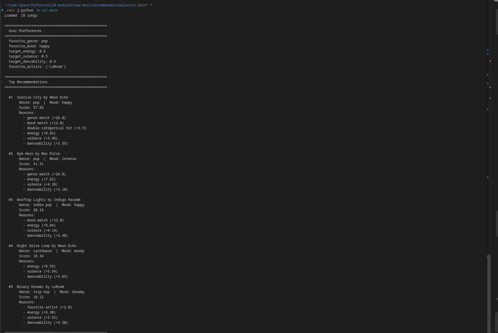
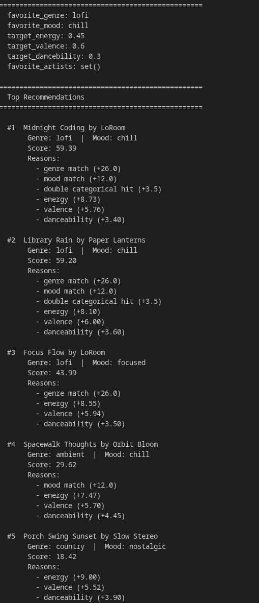
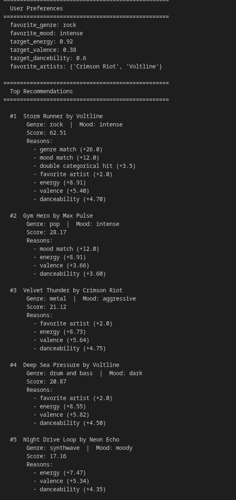
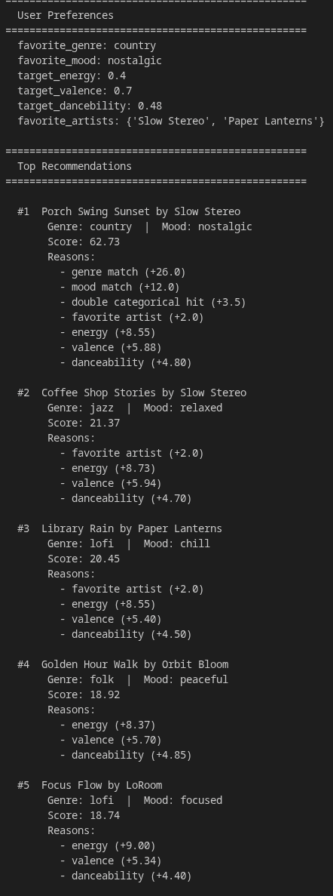
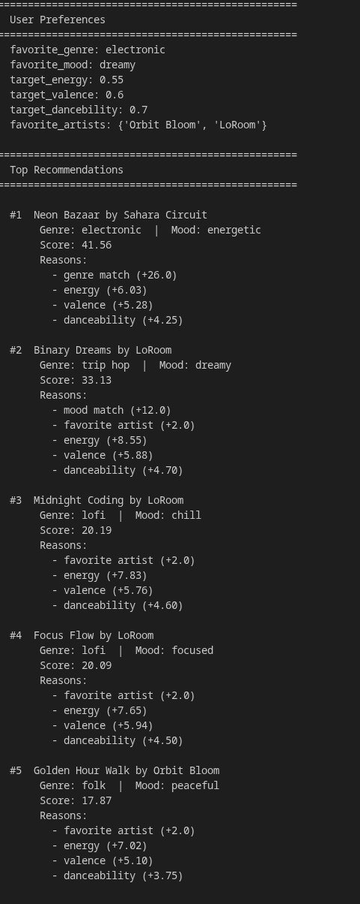
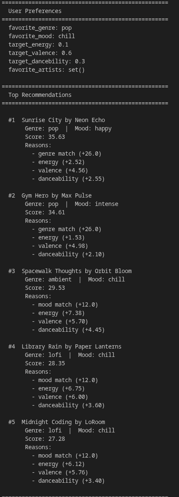
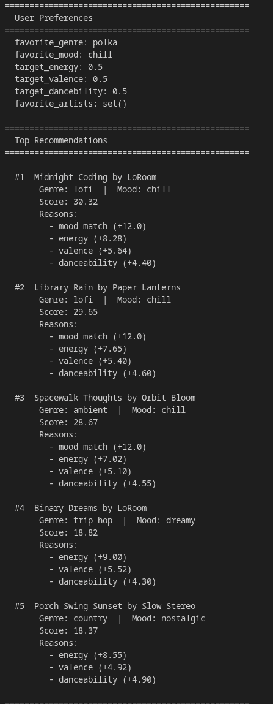
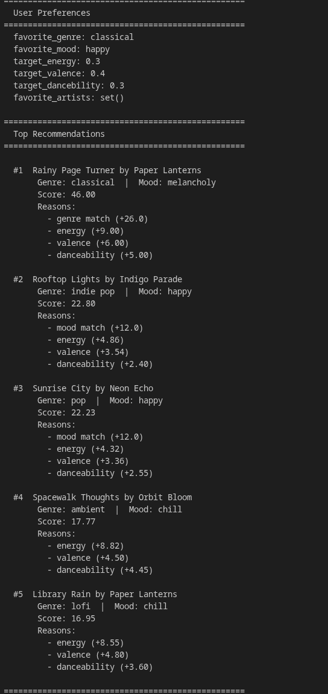
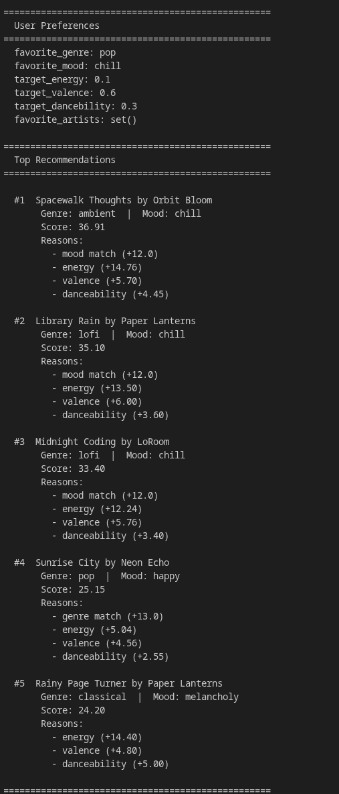

# 🎵 Music Recommender Simulation

## Project Summary

In this project you will build and explain a small music recommender system.

Your goal is to:

- Represent songs and a user "taste profile" as data
- Design a scoring rule that turns that data into recommendations
- Evaluate what your system gets right and wrong
- Reflect on how this mirrors real world AI recommenders

Replace this paragraph with your own summary of what your version does.

---

## How The System Works

Explain your design in plain language.

Some prompts to answer:

- What features does each `Song` use in your system
  - For example: genre, mood, energy, tempo
- What information does your `UserProfile` store
- How does your `Recommender` compute a score for each song
- How do you choose which songs to recommend

You can include a simple diagram or bullet list if helpful.

- The Features used for my recomendation system are: __genre, mood, energy, valence, and danceability__
- Song will use the features above as its values to compare with other songs
- UserProfile will store: user_preference scores for each feature (with numerical values). It will have a list of genres that the User has listened to (maybe with its frequency of which genre a listener listens to, and be sorted with the amount of songs that a user likes). 

- Recommender will use weights to compute each feature based on their importance. $$total = (w1 * score_energy) + (w2 * score_valence) + (w3 * score_danceability) + ...$$
- each one will be calculated using $score = 1 - abs(user_preference - song_value)$ which will base on how much it deiviates from the users prefered value for that feature
- the songs that are recommended using the total score calculated. However for better recommendation it would be better to be able to modify the values of user prefrences based on what the user currently wants to listen to and not the overall choice of the user.

How recommenders work is by using data collected from user listening history of the individual and scoring each songs based on each feature, we can give recommendations using a formula like the one above to give more fitting recommendations for the user. The weights provide fine tuning for us to focus more on whats more important for the listener. The app collects data on what songs one will dislike or like and attempts to use the values given to a song to determine the user_preference score for each feature and to limit any deviation from what the user would want to listen.
---
Algorithm recipe: 
- +26.0 points for genre match
- +12.0 for mood match
- +3.5 for double categorical hit (both genre AND mood match)
- +2.0 for favorite artist
- -4.0 for mood clash (chill↔aggressive, peaceful↔intense)
- closeness x 9.0 for energy
- closeness x 6.0 for valence
- closeness x 5.0 for danceability
- closeness = 1 - abs(user_pref - song_value)

Genres is still the main bias out of all the features. However, the other features added together is more than it, allowing songs from other genres that might also be good recommendations.



















## Getting Started

### Setup

1. Create a virtual environment (optional but recommended):

   ```bash
   python -m venv .venv
   source .venv/bin/activate      # Mac or Linux
   .venv\Scripts\activate         # Windows

2. Install dependencies

```bash
pip install -r requirements.txt
```

3. Run the app:

```bash
python -m src.main
```

### Running Tests

Run the starter tests with:

```bash
pytest
```

You can add more tests in `tests/test_recommender.py`.

---

## Experiments You Tried

Use this section to document the experiments you ran. For example:

- What happened when you changed the weight on genre from 2.0 to 0.5
- What happened when you added tempo or valence to the score
- How did your system behave for different types of users

### Experiment 1: modifying weights
__Changed genres weight 26 -> 13__
__Changed energy weight 12 -> 24__

Before: 
After: 

---

## Limitations and Risks

Summarize some limitations of your recommender.

Examples:

- It only works on a tiny catalog
- It does not understand lyrics or language
- It might over favor one genre or mood

__This recommender is very static. It only created using the information of the given songs in songs.csv. If another song with a different genre comes in for example, it wasn't built with it in mind so something like the penalty for mood clash won't apply if the context reqires it to. It doesn't include lyrics which will influence the nuancec and the context of the song. 'Moody' songs for example is very diverse in its subjects. It might mean a sad rainy afternoon at a coffee shop or a somber walk in a dark forest in an alternitive reality kind of music. The lyrics in a romance song can be a tragedy or a happy song. Also two moods might apply to a song.__
---

## Reflection

Read and complete `model_card.md`:

[**Model Card**](model_card.md)

<!-- Write 1 to 2 paragraphs here about what you learned:

- about how recommenders turn data into predictions
- about where bias or unfairness could show up in systems like this
 -->

---

